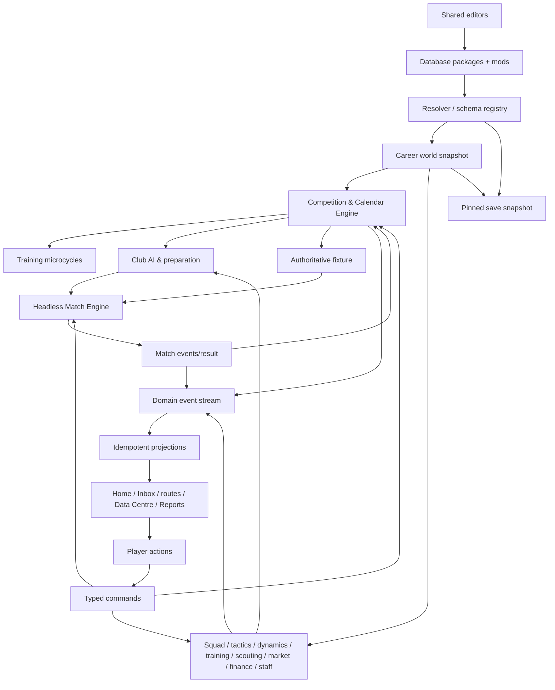

<!-- generated-by: gsd-doc-writer -->

# Phase Dependency Graph

## Canonical DAG

```mermaid
flowchart LR
  B["Stable baseline 1–6"] --> P061["06.1 tables — complete"] --> P062["06.2 tactical field"] --> P063["06.3 tactical model"] --> P064["06.4 profiles/ratings"] --> P065["06.5 database/mod foundation"] --> P066["06.6 menu/career/coach"] --> P067["06.7 competition/calendar"]
  P063 --> P068["06.8 dynamics/training"]
  P064 --> P068
  P067 --> P068
  P062 --> P072["07.2 match engine"]
  P063 --> P071["07.1 club AI/preparation"]
  P064 --> P071
  P065 --> P071
  P068 --> P071
  P071 --> P072
  P064 --> P072
  P065 --> P072
  P066 --> P072
  P067 --> P072
  P068 --> P072
  P072 --> P073["07.3 Match Center"] --> P074["07.4 in-match decisions"]
  P072 --> P075["07.5 post-match"]
  P074 --> P075
  P075 --> P081["08.1 availability/registration"] --> P082["08.2 transfers/contracts"] --> P083["08.3 scouting"] --> P084["08.4 finance/club/staff"] --> P085["08.5 Home/Inbox/Data/Reports"] --> P086["08.6 MVP1 gate"]
  P086 --> P091["09.1 rollover/history"] --> P092["09.2 promotion/competitions"] --> P093["09.3 advanced market/AI"] --> P094["09.4 youth/renewal"] --> P095["09.5 scouting network"] --> P096["09.6 board/infrastructure/finance"] --> P097["09.7 editors/mods"] --> P098["09.8 MVP2 gate"]
```

Additional non-linear prerequisites are authoritative in `ROADMAP.md`; this diagram intentionally shows a conservative executable order and contains no cycle.

## System production/consumption graph

## Mandatory dependency assertions

- 06.3 depends on 06.2; 06.4 on 06.3.
- 06.5 supplies base/mods to 06.6 and 06.7; 06.6 depends on 06.5; 06.7 on 06.5 and 06.6.
- 06.8 depends on 06.3, 06.4 and 06.7.
- 07.1 depends on sporting systems/database; 07.2 on 06.2–06.8 and 07.1.
- 07.3 depends on 07.2; 07.4 on 07.2/07.3; 07.5 on engine/full match state.
- MVP1 depends on Blocks 06–08; MVP2 depends on completed MVP1.

## Cycle prevention

Dependencies point from schemas/foundations to stateful domains to events/projections to UI. A route may issue a command to a domain but is never a build-time/domain dependency. Match result updates Competition through an application/event contract; Competition does not depend on Match implementation. Training reads Calendar projections; Calendar never imports Training. Editors emit validated packages; runtime domains do not depend on editor UI.
