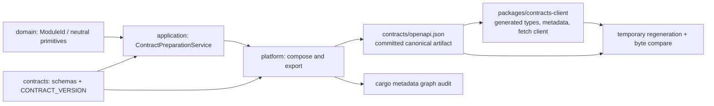

# Phase 3: Rust Modular Monolith and API Contract Pipeline - Research

**Researched:** 2026-07-13  
**Domain:** Rust modular-monolith boundaries and deterministic OpenAPI-to-TypeScript generation  
**Confidence:** HIGH for locked architecture and `utoipa`; MEDIUM for the TypeScript generator because the legitimacy gate flags its latest publication as SUS.

## User Constraints

### Crate topology and dependency direction

- **D-01:** Enforce strict inward dependencies: `domain` depends on no other phase crate; `application` depends on `domain`; `contracts` depends only on permitted core types; `platform` is the only outer layer that may depend on `application` and `contracts`.
- **D-02:** Create `platform` now only because it owns contract composition, OpenAPI export, pipeline integration, and test-only fixtures. It must not host an HTTP server or persistence adapter.
- **D-03:** `application` must have a real, non-product responsibility: a contract-preparation service that orchestrates assembly from `domain` and `contracts` without an HTTP endpoint.
- **D-04:** `domain` contains neutral core primitives and module identity used by contract preparation. It must not contain clubs, players, matches, leagues, or other football entities.

### Canonical Rust contract and OpenAPI export

- **D-05:** `contracts` is the canonical location for transport schemas and OpenAPI metadata; `platform` only composes and exports the document.
- **D-06:** Define one explicit semantic-version constant in `contracts`; OpenAPI and generated TypeScript output consume that same version.
- **D-07:** Use a mature code-first Rust OpenAPI library. Research/planning selects the exact library only if it supports deterministic output and preserves `contracts` as the source of truth.
- **D-08:** Version the generated OpenAPI document at `contracts/openapi.json`.

### Generated TypeScript contract client

- **D-09:** Put generated TypeScript artifacts in the dedicated workspace package `packages/contracts-client`, independent of any application.
- **D-10:** Generate types, contract metadata, and a minimum client only. Do not add authentication, retries, product transport conveniences, or hand-maintained request/response duplicates.
- **D-11:** Research/planning selects a mature deterministic TypeScript generator; it must generate the required types and minimum client without manually editing output.
- **D-12:** Expose explicit root commands for OpenAPI generation, TypeScript client generation, and drift verification. `pnpm check` invokes verification-only, non-mutating commands.

### Test-only contract-pipeline fixture

- **D-13:** Prefer schema-only generation. Add a fixture only if the selected tool genuinely requires an operation to prove the pipeline.
- **D-14:** Any required fixture is a test-only module with no runtime registration and no runtime artifact.
- **D-15:** A permitted fixture exposes only neutral contract introspection metadata; it has no state, football data, authentication, or persistence.
- **D-16:** Automated tests must prove that a fixture is usable by the pipeline yet absent from every production runtime registration.

### the agent's Discretion

- Exact crate names, generator libraries, dependency-policy file format, OpenAPI metadata fields beyond the explicit contract version, and test implementation patterns may be selected through research, provided they satisfy D-01 through D-16 and `03-SPEC.md`.

### Deferred Ideas

None — discussion stayed within Phase 3 scope.

## Summary

Use four exercised crates: `rivallo-domain`, `rivallo-application`, `rivallo-contracts`, and `rivallo-platform`. The only production dependency edges are `application -> domain`, `application -> contracts` (for the preparation result), and `platform -> application, contracts`; `domain` has no Phase-3-crate edge and `contracts` has no Phase-3-crate edge. Keep `platform` a library/binary generator composition boundary only—no axum, Tauri, network listener, persistence adapter, or runtime registration. This implements FOUND-03 while reserving runtime/API work for Phase 4. [VERIFIED: repository Phase 3 CONTEXT.md and SPEC.md]

Use `utoipa` 5.5.0 with its `macros` feature for `ToSchema` contract models and a schema-only `#[derive(OpenApi)]` document that lists `components(schemas(...))`; the derive documentation explicitly supports component schemas separately from its optional `paths(...)` list. Serialize the composed `OpenApi` document once in `platform` with a stable pretty-JSON policy, then write only `contracts/openapi.json`. [VERIFIED: https://docs.rs/utoipa/5.5.0/utoipa/derive.OpenApi.html]

Use a pinned `@hey-api/openapi-ts` 0.97.3 configuration to consume only `contracts/openapi.json` and emit the dedicated client package. Its official documentation exposes a TypeScript plugin, SDK plugin, and Fetch client and documents configuration-driven `createClient()` output. It therefore can prove OpenAPI-to-types/client without inventing a product endpoint; with a schema-only document the generated operation SDK may be empty, but generated schema types plus a generated fetch client/metadata barrel still prove the required pipeline. [CITED: https://heyapi.dev/docs/openapi/typescript/get-started]

**Primary recommendation:** build a schema-first `utoipa` exporter in `platform`, commit canonical JSON in `contracts/`, then run pinned Hey API generation into `packages/contracts-client`; implement all check commands as temporary-directory regeneration plus byte comparison.

## Project Constraints (from AGENTS.md)

- The repository contains no `AGENTS.md`; the task-supplied instruction requires `rtk` prefixes for routine shell commands. [VERIFIED: repository root inspection and task instruction]
- Preserve Phase 2 portability: root scripts invoke Node/Rust logic, never PowerShell/POSIX shell chains; Rust/Cargo children retain `RUSTUP_AUTO_INSTALL=0`. [VERIFIED: 02-CONTEXT.md; docs/operations/local-development.md]
- Checks are non-mutating, fail fast, warnings-denied where applicable, and repeatable from a clean checkout. [VERIFIED: 02-CONTEXT.md; 03-SPEC.md]

## Architectural Responsibility Map

| Capability | Primary Tier | Secondary Tier | Rationale |
|---|---|---|---|
| Neutral module identity/primitives | domain | — | Domain remains framework/product neutral. [VERIFIED: 03-CONTEXT.md D-01/D-04] |
| Contract-preparation service | application | domain, contracts | Real non-product orchestration consumes only inward/core inputs. [VERIFIED: 03-CONTEXT.md D-03] |
| Schema definitions and semantic contract version | contracts | — | Canonical source of transport schemas/OpenAPI metadata. [VERIFIED: 03-CONTEXT.md D-05/D-06] |
| OpenAPI composition/export and pipeline test wiring | platform | application, contracts | The outer composition boundary is required but is not a server. [VERIFIED: 03-CONTEXT.md D-02/D-05] |
| Generated TypeScript package | `packages/contracts-client` | contracts/openapi.json | Generated output is independent of applications and traceable to the committed OpenAPI input. [VERIFIED: 03-CONTEXT.md D-08–D-12] |

## Standard Stack

### Core

| Library | Version | Purpose | Why Standard |
|---|---:|---|---|
| `utoipa` | 5.5.0 | Rust `ToSchema`/`OpenApi` derives and OpenAPI model. | Official rustdoc documents schema components and OpenAPI derive metadata; package legitimacy is OK. [VERIFIED: docs.rs/utoipa/5.5.0; package-legitimacy check] |
| `@hey-api/openapi-ts` | 0.97.3 exact pin | Generate TypeScript schema types, metadata, and a minimal Fetch client from OpenAPI. | Official docs document configuration and TypeScript/SDK/Fetch plugins; use only after the mandatory human verification checkpoint below. [CITED: heyapi.dev/docs/openapi/typescript/get-started] |

### Supporting

| Library | Version | Purpose | When to Use |
|---|---:|---|---|
| `serde_json` | Cargo-resolved via `utoipa` | Serialize the generated OpenAPI model to committed JSON. | Platform generator only; do not introduce it into domain unless the domain allowlist intentionally permits it. [VERIFIED: docs.rs/utoipa/5.5.0 dependencies] |
| Cargo `metadata` | Rust toolchain | Emit the resolved package/resolve graph for policy auditing. | Every architecture/domain-dependency check must inspect this real graph. [CITED: https://doc.rust-lang.org/cargo/commands/cargo-metadata.html] |

### Alternatives Considered

| Instead of | Could Use | Tradeoff |
|---|---|---|
| `utoipa` | axum-specific OpenAPI integration | Rejected: Phase 3 must not introduce an HTTP framework/runtime. [VERIFIED: 03-SPEC.md scope; docs.rs/utoipa/5.5.0] |
| `@hey-api/openapi-ts` | Orval | Rejected for this plan: it is similarly feature-rich but its latest npm publication was also flagged SUS; do not add two generator candidates. [VERIFIED: Orval official overview; package-legitimacy check] |

**Installation (after the checkpoint):**

```text
cargo add utoipa@5.5.0 --features macros --package rivallo-contracts
pnpm add -D --save-exact @hey-api/openapi-ts@0.97.3 --workspace-root
```

## Package Legitimacy Audit

| Package | Registry | Age / downloads | Source Repo | Verdict | Disposition |
|---|---|---|---|---|---|
| `utoipa` | crates.io | Published 2022-01-27; 860,781 weekly | github.com/juhaku/utoipa | OK | Approved. [VERIFIED: package-legitimacy check] |
| `@hey-api/openapi-ts` | npm | Package created 2024-03-22; 2,878,338 weekly | github.com/hey-api/hey-api | SUS: latest release flagged `too-new` | Pin 0.97.3 and add `checkpoint:human-verify` before install. [VERIFIED: npm registry; package-legitimacy check] |
| `orval` | npm | 1,292,963 weekly | github.com/orval-labs/orval | SUS: latest release flagged `too-new` | REMOVED; not selected. [VERIFIED: package-legitimacy check] |

**Packages removed due to SLOP:** none.  
**Packages flagged SUS:** `@hey-api/openapi-ts`; planner must add `checkpoint:human-verify` before its installation.

## Architecture Patterns

### System Architecture Diagram



The primary path is schema-first: no runtime request enters this phase. A deterministic exporter creates OpenAPI from Rust schemas, and the TypeScript generator consumes only the committed OpenAPI artifact. [VERIFIED: 03-SPEC.md R3–R6]

### Recommended Project Structure

```text
crates/
├── domain/                 # ModuleId and neutral primitives only
├── application/            # ContractPreparationService only
├── contracts/              # schemas, CONTRACT_VERSION, openapi.json
└── platform/               # OpenAPI composition/export and pipeline integration test
packages/
└── contracts-client/       # generated-only TypeScript output and package metadata
scripts/
├── generate-openapi.mjs    # explicit writer orchestration
├── generate-contract-client.mjs
├── verify-contract-drift.mjs
└── verify-cargo-architecture.mjs
```

### Pattern 1: Schema-first Utoipa document

**What:** derive `ToSchema` in `contracts`, derive `OpenApi` over `components(schemas(...))`, and compose the metadata/version in `platform`; do not annotate an axum handler. [VERIFIED: docs.rs/utoipa/5.5.0]

**When to use:** this phase, because schema components are sufficient and operations are prohibited unless a generator demonstrably requires one. [VERIFIED: 03-CONTEXT.md D-13–D-16]

```rust
// Source: https://docs.rs/utoipa/5.5.0/utoipa/derive.OpenApi.html
#[derive(utoipa::ToSchema)]
pub struct ContractManifest {
    pub version: String,
}

#[derive(utoipa::OpenApi)]
#[openapi(components(schemas(ContractManifest)))]
struct ContractDocument;
```

### Pattern 2: Verify by generating elsewhere

**What:** writer commands are explicit and serialized; verifier commands create isolated temporary output, then perform byte-for-byte comparisons against tracked artifacts. [VERIFIED: 03-SPEC.md R4–R5 and constraints]

**When to use:** `pnpm check`, CI later, and every drift assertion. The verifier must never write `contracts/openapi.json` or `packages/contracts-client`. [VERIFIED: 03-CONTEXT.md D-12; 03-SPEC.md]

### Pattern 3: Metadata graph policy

**What:** execute `cargo metadata --format-version=1`, find the domain package node, traverse all reachable `resolve.nodes[*].dependencies`, and check both allowed Phase-3 edges and forbidden package names. Cargo documents this as JSON metadata with a resolve graph. [CITED: https://doc.rust-lang.org/cargo/commands/cargo-metadata.html]

**When to use:** as a standalone `pnpm rust:architecture` command and within the aggregate check. Include a controlled test fixture/graph assertion proving a transitive denylist reachability failure. [VERIFIED: 03-SPEC.md acceptance criteria]

### Anti-Patterns to Avoid

- **Manifest-text-only dependency validation:** it misses transitive dependencies; traverse Cargo's resolved graph instead. [VERIFIED: 03-SPEC.md]
- **OpenAPI owned by platform:** platform composes/exports only; schemas and semantic version remain in contracts. [VERIFIED: 03-CONTEXT.md D-05/D-06]
- **A convenience axum route:** it violates the no-runtime-endpoint boundary. [VERIFIED: 03-SPEC.md]
- **Verifier calling the writer in-place:** it silently repairs drift and violates non-mutating checks. [VERIFIED: 03-SPEC.md]
- **Unpinned generator CLI:** output can change without an input change; use exact lockfile/version and compare bytes. [ASSUMED]

## Don't Hand-Roll

| Problem | Don't Build | Use Instead | Why |
|---|---|---|---|
| Rust schema/OpenAPI conversion | Custom reflection or manually assembled JSON | `utoipa` derives/model | It keeps contracts in Rust and documents schema-component support. [VERIFIED: docs.rs/utoipa/5.5.0] |
| OpenAPI-to-TypeScript translation | Hand-maintained interfaces or ad-hoc templates | pinned `@hey-api/openapi-ts` | The official generator supports configured output plus TypeScript/SDK/client plugins. [CITED: heyapi.dev/docs/openapi/typescript/get-started] |
| Dependency graph discovery | Cargo.toml string parsing | `cargo metadata --format-version=1` | Cargo supplies the resolved metadata/resolve graph. [CITED: doc.rust-lang.org/cargo/commands/cargo-metadata.html] |
| Drift assertion | Git diff after mutating regeneration | temp-directory byte comparison | It preserves check-mode idempotence and gives an explicit repair command. [VERIFIED: 03-SPEC.md] |

**Key insight:** determinism is a pipeline property: exact tool versions, stable source ordering/serialization, serialized explicit writers, and non-mutating temporary-output checks must work together. [ASSUMED]

## Common Pitfalls

| Pitfall | Prevention / verification |
|---|---|
| A schema-only document yields no operations. | Treat this as valid proof; only add a neutral test fixture if the selected generator fails without an operation, then assert it is absent from all production registration. [VERIFIED: 03-CONTEXT.md D-13–D-16] |
| `contracts` imports domain/application types. | Permit only explicitly approved neutral core types; otherwise duplicate neither model nor business rule—move the neutral primitive to domain. [VERIFIED: 03-CONTEXT.md D-01/D-05] |
| `domain` accidentally gains `utoipa`/network/framework transitively. | Apply a small positive allowlist and denylisted package-family reachability scan over real metadata. [VERIFIED: 03-SPEC.md R2] |
| JSON differs because a timestamp, absolute path, or map order leaks into output. | Set only stable metadata, avoid environment/time fields, serialize once with a fixed formatter, and run generation twice in an integration test. [ASSUMED]
| Generated client metadata does not read the contract semantic version. | Make generation config/package metadata derive it from `openapi.json.info.version`; test equality with the Rust `CONTRACT_VERSION` exported into the document. [VERIFIED: 03-CONTEXT.md D-06] |
| Multiple commands write the same artifact concurrently. | Route writers through individual root commands and never schedule them in parallel; drift checks use unique temp directories. [VERIFIED: 03-SPEC.md constraints] |

## Security Considerations

- The domain audit denies direct and transitive framework, HTTP/network, persistence/database, frontend, and platform dependencies; include at least axum, tauri, sqlx, rusqlite, postgres, tokio-postgres, reqwest, hyper, and their project-approved equivalents in the policy. [VERIFIED: 03-SPEC.md]
- Generated input is a repository-local committed file; the generator must not fetch a remote OpenAPI URL or execute a postinstall hook. The selected npm package reported `postinstall: null`. [VERIFIED: package-legitimacy check]
- Generation checks must produce actionable failures without altering tracked files, preventing a validation command from masking unexpected contract changes. [VERIFIED: 03-SPEC.md]

## Code Examples

```text
# explicit writers (serialized by the root task runner)
pnpm contracts:openapi:generate
pnpm contracts:client:generate

# non-mutating verifiers; each prints its writer repair command on drift
pnpm contracts:openapi:check
pnpm contracts:client:check
pnpm rust:architecture
```

```text
# metadata audit input; parse JSON in a cross-platform Node script
cargo metadata --format-version=1
```

The exact command names are a planner choice, but they must be root-owned, cross-platform, atomic, non-mutating in check mode, and included in `pnpm check` in a fail-fast order. [VERIFIED: 02-CONTEXT.md D-01/D-02/D-12–D-16; 03-CONTEXT.md D-12]

## Verification Checklist

- [ ] `cargo metadata` lists exactly the four exercised Phase-3 crates and policy accepts only allowed edges.
- [ ] A controlled graph assertion demonstrates an inverted edge and a transitive domain denylist hit fail non-zero.
- [ ] Domain's reachable graph has no forbidden framework/platform/network/persistence/database packages.
- [ ] Rust exporter run twice produces byte-identical `contracts/openapi.json`; check mode compares a temporary export and prints its writer command on drift.
- [ ] TypeScript generation consumes only `contracts/openapi.json`; repeat generation is byte-identical and client drift check is non-mutating/actionable.
- [ ] Pipeline integration test proves Rust schemas → OpenAPI → generated types/client/metadata; no production endpoint is registered.
- [ ] If a fixture is necessary, it is neutral, test-only, excluded from runtime artifacts, and its absence from production registration is tested.
- [ ] `pnpm check` retains Phase 2's toolchain-first, warning-blocking, cross-platform, `RUSTUP_AUTO_INSTALL=0` behavior.
- [ ] Source/script inventory contains no football model, axum/Tauri runtime, persistence, auth, Docker/CI, or multiplayer code.

## Sources

- [Utoipa OpenApi derive documentation](https://docs.rs/utoipa/5.5.0/utoipa/derive.OpenApi.html) — schema component and derive capability. [VERIFIED]
- [Hey API OpenAPI TypeScript Get Started](https://heyapi.dev/docs/openapi/typescript/get-started) — configuration, `createClient`, TypeScript/SDK/client plugin surface. [CITED]
- [Cargo metadata command reference](https://doc.rust-lang.org/cargo/commands/cargo-metadata.html) — JSON metadata and resolve graph. [CITED]
- Repository canonical inputs named in the task — scope, decisions, Phase 2 portability, and test policy. [VERIFIED]

## Research Gaps

- `cargo search utoipa --limit 1` could not run in this agent environment because `cargo` was not on PATH; the package-legitimacy seam independently confirmed the crates.io package, publication date, downloads, and repository. [VERIFIED: command result; package-legitimacy check]
- Context7 was requested by the research plan but was unavailable in this agent tool surface and its CLI fallback (`ctx7`) was absent; official documentation was fetched directly instead. [VERIFIED: research-plan result; `where ctx7` result]
- The package gate flags `@hey-api/openapi-ts` as SUS solely because its latest release is new despite high download volume and an official repository/docs presence; do not waive the mandatory human checkpoint. [VERIFIED: package-legitimacy check]
