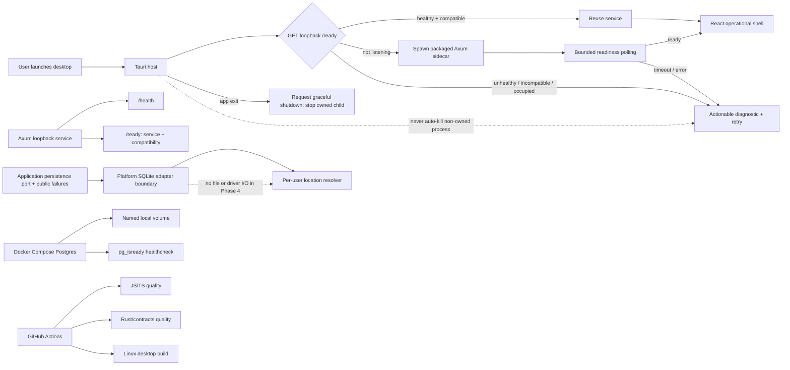

# Phase 4: Desktop Shell, Local Persistence Boundary, Containers and CI Skeleton - Research

**Researched:** 2026-07-14  
**Domain:** Tauri 2 desktop lifecycle, loopback Axum service, persistence ports, local Docker Compose, and GitHub Actions  
**Confidence:** MEDIUM

<user_constraints>
## User Constraints (from CONTEXT.md)

### Locked Decisions

### Desktop and local API lifecycle

- **D-01:** The Tauri desktop owns the local API lifecycle: it starts, monitors, and stops the local Axum service automatically.
- **D-02:** On launch, the desktop detects and reuses a healthy compatible Rivallo local service. A conflicting or unhealthy process produces an actionable diagnostic; it is never terminated automatically and the port is not silently changed.
- **D-03:** The desktop waits for `/ready` for a short bounded interval, presenting an initializing state. A timeout or failure is recoverable through retry.
- **D-04:** Startup failures present a clear user-facing message and retry action. Copyable technical diagnostics are restricted to a development-oriented area; raw logs are not shown in the ordinary UI.

### SQLite local-persistence boundary

- **D-05:** Phase 4 prepares only the persistence port and an outer SQLite adapter boundary. It creates no database file, schema, migration, seed, or product persistence behavior.
- **D-06:** The application owns the persistence port; the SQLite adapter belongs to platform. The domain, React UI, and Tauri-facing UI layer must not know SQLite.
- **D-07:** The platform resolves a per-user local-data location through an abstraction. No repository-relative database path is fixed and no file is created in this phase.
- **D-08:** The boundary anticipates typed, recoverable persistence failures that distinguish local-store unavailability from invalid data, without leaking database details to UI consumers.

### Local PostgreSQL in Docker

- **D-09:** Local PostgreSQL is operated with documented Docker Compose commands for start, health verification, and stop. The phase does not provision external services or Neon.
- **D-10:** A named Docker volume persists local PostgreSQL data by default. Destructive removal is available only through a separate, explicit documented command.
- **D-11:** Development connection values may be documented and overridden with environment variables, but are non-secret local defaults. No real credential or committed `.env` file is permitted.
- **D-12:** Docker provides only container, network, volume, and database healthcheck. It creates no schema, migrations, fixtures, or product tables.

### CI skeleton

- **D-13:** Use GitHub Actions for pull requests and pushes to the primary branch.
- **D-14:** CI separates the minimum relevant work into JavaScript/TypeScript quality, Rust/contracts quality, and desktop-build jobs rather than one opaque aggregate job.
- **D-15:** The initial desktop integration build runs on Linux only. Windows/macOS packaging and a cross-platform build matrix are deferred.
- **D-16:** Dependency caches are permitted for CI speed. This phase publishes no installers, screenshots, or application artifacts.

### the agent's Discretion

- Exact process-management API, retry interval, readiness timeout, healthcheck interval, Compose service names, action versions, and job-command mapping may be selected during research/planning, provided they preserve D-01 through D-16 and the pre-existing architecture boundaries.

### Deferred Ideas (OUT OF SCOPE)

- Cross-platform CI build matrix and distributable desktop packages — later release/verification work.
- SQLite schema, migrations, local-career storage, cache, and restoration — Phase 8 and Phase 9.
- PostgreSQL schema, migrations, hosted Neon, and multiplayer persistence — later data and V0.2 phases.
</user_constraints>

<phase_requirements>
## Phase Requirements

| ID | Description | Research Support |
|---|---|---|
| FOUND-01 | Repository has Tauri/React/Rust workspace boundaries and repeatable local tooling. | Tauri 2 shell, managed Axum sidecar, application-owned persistence port, local Compose commands, and Linux desktop build establish the remaining executable boundary. |
| FOUND-02 | CI independently verifies frontend, Rust, integration, contracts, visual checks, and desktop build. | This phase establishes the scoped JavaScript/TypeScript, Rust/contracts, and Linux desktop-build jobs only; later visual and end-to-end coverage remains deferred. |
</phase_requirements>

## Project Constraints (from AGENTS.md)

- Prefix routine shell commands with `rtk`; use `rtk proxy` where no filtered command exists.
- Preserve the existing dirty-worktree policy and use `apply_patch` for file edits.
- Existing project constraints from Phase 2 are equally binding: Node-orchestrated cross-platform commands, no PowerShell/POSIX-only quality workflow, no automatic tool installation, `RUSTUP_AUTO_INSTALL=0` for every Rust/Cargo child process, and non-mutating aggregate checks.

## Summary

Use a narrow three-process boundary: the Tauri host owns a packaged local Axum sidecar; the sidecar binds only to the fixed loopback address and publishes `GET /health` plus a versioned `GET /ready`; the React shell consumes the already-generated contracts client. Tauri documents external-binary sidecars and managed child-process execution, while Axum's `Serve` supports graceful shutdown. [CITED: https://v2.tauri.app/develop/sidecar/] [CITED: https://docs.rs/axum/0.8.9/axum/serve/struct.Serve.html]

Before spawning, the desktop probes the fixed loopback `/ready`. A compatible response is reused; any unhealthy, incompatible, or occupied-port result becomes a diagnostic and a retry path, never a kill or a silent alternative port. The recommended readiness payload is deliberately small: service identifier, contract version, and build/protocol compatibility marker. A five-second bounded wait with short polling is a planning recommendation, not a product contract. [ASSUMED]

Phase 4 should define, but not open, a SQLite persistence boundary. Put the port and public error taxonomy in `application`; place an unconnected `SqlitePersistenceAdapter` and a user-data-directory resolver abstraction in `platform`; do not add SQLx/SQLite I/O or create a database file. Compose PostgreSQL is independent developer infrastructure with a named volume and `pg_isready` healthcheck. [CITED: https://docs.docker.com/reference/compose-file/volumes/]

**Primary recommendation:** Build the smallest Tauri-managed loopback sidecar and its testable lifecycle state machine, preserve application/platform persistence ownership without a driver, and wire only scoped Linux CI checks.

## Architectural Responsibility Map

| Capability | Primary Tier | Secondary Tier | Rationale |
|---|---|---|---|
| Local API lifecycle, process handle, retry request | Desktop host / platform | React UI | Native host has process authority; UI only renders lifecycle state and invokes a narrow command. |
| `/health` and `/ready` | Local API / platform | Desktop host | The service is authoritative for its own readiness; host observes it over loopback. |
| Generated transport types | Shared TypeScript contracts package | React UI | Phase 3 owns the generated client; Phase 4 must consume rather than duplicate it. |
| Persistence port and typed public failures | Application | Platform adapter | The use-case boundary owns the abstraction; storage detail remains outward. |
| Per-user data directory resolution | Platform | Application port consumer | Platform knows OS locations; application must not know a filesystem or SQLite path. |
| SQLite adapter implementation boundary | Platform | — | It is the only tier permitted to know SQLite, but Phase 4 does not connect or create a store. |
| Local PostgreSQL service/volume/healthcheck | Docker / local infrastructure | Documentation | Compose owns infrastructure only, not schemas or application behavior. |
| Quality and desktop build verification | GitHub Actions | Existing root scripts | CI calls existing non-mutating commands in separate jobs; it does not invent an opaque aggregate. |

## Standard Stack

### Core

| Library | Version verified | Purpose | Why standard |
|---|---:|---|---|
| `tauri` | 2.11.5 | Desktop host, command bridge, packaging/build integration | Accepted ADR-0002 stack; crates.io registry and Tauri's official sidecar guide confirm the supported host/sidecar model. [CITED: https://v2.tauri.app/develop/sidecar/] |
| `tauri-plugin-shell` | 2.3.5 | Spawn and retain a managed local API sidecar handle | Official Tauri sidecar guidance uses the shell plugin; it supports child-process management. [CITED: https://v2.tauri.app/develop/sidecar/] |
| `axum` | 0.8.9 | Local loopback HTTP router and readiness handlers | Phase stack names Axum; its `Serve` API supports graceful shutdown. [CITED: https://docs.rs/axum/0.8.9/axum/serve/struct.Serve.html] |
| `tokio` | 1.52.3 | Async listener, cancellation, and service runtime | Axum's async runtime dependency; use only the features needed for net, signal/cancellation, sync, and macros. [CITED: https://docs.rs/tokio/1.52.3/tokio/] |

### Supporting

| Library / tool | Version verified | Purpose | When to use |
|---|---:|---|---|
| `@tauri-apps/cli` | 2.11.4 | Tauri development/build command | Add with a human checkpoint: legitimacy seam flags the latest npm publication as too new. |
| `@tauri-apps/api` | 2.11.1 | Narrow React-to-Tauri invoke bridge | Add with a human checkpoint: legitimacy seam flags the latest npm publication as too new. |
| React 19.2.7, Vite 8.1.4, `@vitejs/plugin-react` 6.0.3 | verified from npm | Minimal webview UI build | Scaffold only the operational shell; no design-system or product-screen work. Vite/plugin require a human checkpoint because their latest publications were flagged too new. |
| Docker Compose + official `postgres` image | local CLI/image | Local PostgreSQL container, named volume, healthcheck | Only for documented local development; no image-based migration/init scripts. [CITED: https://docs.docker.com/reference/compose-file/] |
| GitHub Actions `checkout`, `setup-node`, `pnpm/action-setup` | pin reviewed major versions | CI checkout, runtime setup, dependency-store cache | Cache package-manager stores keyed by lockfile; never cache credentials, target outputs, installers, or app artifacts. [CITED: https://docs.github.com/actions/writing-workflows/choosing-what-your-workflow-does/caching-dependencies-to-speed-up-workflows] |

### Alternatives Considered

| Instead of | Could Use | Tradeoff |
|---|---|---|
| Tauri-managed sidecar | Desktop invokes an already-running API manually | Contradicts D-01 and makes dependable startup/recovery the user's problem. |
| Fixed loopback endpoint with compatibility probe | Random port / automatic port fallback | Contradicts D-02; hides conflicts and undermines deterministic diagnostics. |
| Application port plus inert platform boundary | Direct SQLite in handlers/React | Contradicts D-05–D-08 and makes later persistence migration expensive. |
| Separate CI jobs | A single `pnpm check` CI job | Contradicts D-14 and obscures which quality layer failed. |

**Installation:** Add only the audited packages above after the required human checks for packages flagged `SUS`; do not add an SQLite driver in Phase 4. Use Cargo manifests and `pnpm` commands, preserving the existing frozen-lockfile and no-auto-install policy.

## Package Legitimacy Audit

| Package | Registry | First published | Downloads/week | Source repo | Verdict | Disposition |
|---|---|---:|---:|---|---|---|
| `tauri` | crates.io | 2019-11-27 | 613,674 | tauri-apps/tauri | OK | Approved |
| `tauri-plugin-shell` | crates.io | 2023-05-24 | 248,902 | tauri-apps/plugins-workspace | OK | Approved |
| `axum` | crates.io | 2021-07-22 | 7,496,633 | tokio-rs/axum | OK | Approved |
| `tokio` | crates.io | 2016-07-01 | 14,499,600 | tokio-rs/tokio | OK | Approved |
| `@tauri-apps/cli` | npm | 2026-06-28 | 1,680,229 | tauri-apps/tauri | SUS (too new) | Flagged — human verify before install |
| `@tauri-apps/api` | npm | 2026-06-17 | 1,645,593 | tauri-apps/tauri | SUS (too new) | Flagged — human verify before install |
| `@vitejs/plugin-react` | npm | 2026-06-23 | 54,497,110 | vitejs/vite-plugin-react | SUS (too new) | Flagged — human verify before install |
| `vite` | npm | 2026-07-09 | 117,419,398 | vitejs/vite | SUS (too new) | Flagged — human verify before install |
| `react`, `react-dom` | npm | 2026-06-01 | 143,867,154 / 112,109,529 | facebook/react | OK | Approved |

`npm view <package> scripts.postinstall` returned no postinstall script for every audited npm package. `cargo search` and `npm view` verified the listed current registry versions. Package legitimacy was checked through the GSD seam.

**Packages removed due to [SLOP] verdict:** none.  
**Packages flagged as suspicious [SUS]:** `@tauri-apps/cli`, `@tauri-apps/api`, `@vitejs/plugin-react`, and `vite`; every installation must be preceded by a `checkpoint:human-verify` plan task.

## Architecture Patterns

### System Architecture Diagram



### Recommended Project Structure

```text
apps/
  desktop/                    # Vite/React shell and Tauri host configuration
    src/                      # initializing/ready/recoverable-error UI only
    src-tauri/                # host lifecycle owner and sidecar configuration
crates/
  platform/
    src/runtime/              # Axum listener, /health, /ready, shutdown wiring
    src/persistence/sqlite/   # inert adapter boundary and OS-location resolver
  application/
    src/persistence.rs        # port, application-owned public failure taxonomy
docker-compose.yml            # postgres service, named volume, healthcheck only
.github/workflows/ci.yml      # three scoped jobs
```

### Pattern 1: Ownership-aware lifecycle state machine

**What:** Model `probe → reuse | spawn → wait-ready → ready | recoverable-failure`, retaining an owned-child handle only when this host performed the spawn.

**When to use:** Every desktop launch and retry. A retry repeats the probe first; it must not assume that the former child is still live.

**Example:**

```rust
// Sources: https://v2.tauri.app/develop/sidecar/
//          https://docs.rs/axum/0.8.9/axum/serve/struct.Serve.html
enum ServiceState { Initializing, Ready, RecoverableFailure(StartupDiagnostic) }

// Probe fixed loopback /ready. Reuse only a matching compatibility marker.
// Spawn only if nothing is listening. Retain the returned child handle as owned.
// On shutdown, signal graceful stop, then stop only that owned child if needed.
```

### Pattern 2: Readiness is stronger than liveness

**What:** `/health` proves that the process can answer; `/ready` proves that this is a compatible Rivallo service ready for the desktop to use.

**When to use:** Startup/reuse decisions and integration tests. Keep both endpoints local and free of product state.

**Example:**

```rust
// Source: https://docs.rs/axum/0.8.9/axum/serve/struct.Serve.html
Router::new()
    .route("/health", get(health))
    .route("/ready", get(ready));
// serve(listener, app).with_graceful_shutdown(cancellation_token.cancelled_owned())
```

### Pattern 3: Port at the inner boundary, adapter at the outer boundary

**What:** The application declares a persistence capability and stable errors such as `Unavailable` and `InvalidData`; platform maps a future SQLite failure to those errors. The UI sees a recovery-oriented application error, never an SQLite error string.

**When to use:** Define and test compilation/ownership now; add actual SQLite access only in Phase 8.

### Anti-Patterns to Avoid

- **Killing by port/PID:** Cannot prove ownership and violates D-02. Stop only the child this Tauri instance created.
- **A readiness check that returns only HTTP 200:** It cannot distinguish an old/incompatible service from the expected one.
- **Starting SQLite “just to test the adapter”:** Creating a file, schema, or connection violates D-05.
- **Repository-relative local data path:** Breaks per-user semantics and violates D-07.
- **One `ci` job that calls an aggregate command:** Conceals JavaScript, Rust/contracts, and desktop-build responsibility boundaries.
- **Compose initialization SQL or migrations:** Violates D-12 even if it is merely a convenience script.

## Don't Hand-Roll

| Problem | Don't Build | Use Instead | Why |
|---|---|---|---|
| Sidecar packaging/spawn | Custom OS process-path resolution | Tauri sidecar configuration plus shell plugin | Tauri handles target-specific embedded executable naming and managed child APIs. [CITED: https://v2.tauri.app/develop/sidecar/] |
| HTTP router/listener | Raw TCP/HTTP parser | Axum + Tokio | Correct HTTP behavior, routing, and graceful shutdown are already provided. [CITED: https://docs.rs/axum/0.8.9/axum/] |
| Local PostgreSQL lifecycle | Shell scripts / platform-specific service setup | Docker Compose healthcheck and named volume | Declarative, repeatable local environment across supported platforms. [CITED: https://docs.docker.com/reference/compose-file/] |
| Dependency cache keys | Custom archive/upload logic | `setup-node` cache support keyed by lockfile | Official cache lifecycle and immutable cache semantics are already handled. [CITED: https://docs.github.com/actions/writing-workflows/choosing-what-your-workflow-does/caching-dependencies-to-speed-up-workflows] |
| Persistence-error presentation | SQLite/OS error string pass-through | Typed application failures plus a UI mapping | Keeps database details out of Tauri/React and makes recovery copy stable. |

**Key insight:** Lifecycle ownership and persistence ownership are separate boundaries. The host may own a sidecar process, but neither the host nor React may own database behavior.

## Common Pitfalls

| Pitfall | Prevention / verification |
|---|---|
| Sidecar starts before its service is actually ready | Require bounded `/ready` polling and an initializing UI state; test timeout/retry. |
| A stale service satisfies a generic health probe | Require a compatibility marker in `/ready`; test incompatible response produces diagnosis, not reuse. |
| Retry duplicates a running child | Probe first and retain owned-child identity; test retry after success does not spawn a second process. |
| Tauri permissions expose arbitrary shell execution | Scope the shell capability to the exact packaged sidecar; no user-controlled command/path arguments. [CITED: https://v2.tauri.app/develop/sidecar/] |
| CI build misses Linux native dependencies | Install only Tauri-documented Linux prerequisites in the Linux desktop job; compile/build without publishing a bundle. [CITED: https://v2.tauri.app/distribute/pipelines/github/] |
| Docker volume is accidentally destroyed | Document ordinary `down` separately from the explicit destructive `down --volumes` command. [CITED: https://docs.docker.com/reference/cli/docker/compose/down/] |
| Cache restores unsafe or irrelevant content | Cache dependency stores only; never credentials, `.env`, generated app artifacts, or PostgreSQL volume data. [CITED: https://docs.github.com/actions/writing-workflows/choosing-what-your-workflow-does/caching-dependencies-to-speed-up-workflows] |

## Code Examples

### Compose service boundary

```yaml
# Source: https://docs.docker.com/reference/compose-file/services/
services:
  postgres:
    image: postgres:<reviewed-major>
    environment:
      POSTGRES_DB: rivallo_dev
      POSTGRES_USER: rivallo
      POSTGRES_PASSWORD: rivallo
    ports: ["5432:5432"]
    volumes: ["rivallo-postgres-data:/var/lib/postgresql/data"]
    healthcheck:
      test: ["CMD-SHELL", "pg_isready -U rivallo -d rivallo_dev"]
      interval: 5s
      timeout: 3s
      retries: 12
volumes:
  rivallo-postgres-data:
```

The shown values are non-secret local defaults and must be overridable by environment variables; no `.env`, init SQL, migration, fixture, or product table belongs in this phase. The exact image major requires planner-time review. [ASSUMED]

### Scoped CI shape

```yaml
# Source: GitHub Actions caching documentation
on:
  pull_request:
  push:
    branches: [main]
jobs:
  js_quality:        # frozen install; format/lint/typecheck/test
  rust_contracts:    # rust fmt/clippy/test/architecture + contract drift checks
  desktop_linux:     # Linux prerequisites; frozen install; Tauri integration build only
```

Each job should call real existing atomic commands wherever possible, preserve `RUSTUP_AUTO_INSTALL=0`, and run no writer. New scoped checks must also be non-mutating.

## State of the Art

| Old approach | Current approach | Impact |
|---|---|---|
| Desktop UI manually tells users to launch a server | Host-managed local sidecar with readiness probing | Reliable first launch/retry and explicit recovery boundary. [CITED: https://v2.tauri.app/develop/sidecar/] |
| “Health is 200” | Liveness plus compatibility-aware readiness | Prevents accidental reuse of a conflicting old local service. [ASSUMED] |
| Direct client/database access | Application port with platform adapter | Preserves local-first evolution and avoids database leakage into UI. |

## Assumptions Log

| # | Claim | Section | Risk if Wrong |
|---|---|---|---|
| A1 | A five-second readiness ceiling with short polling is appropriate for the local service. | Summary | Startup UX may need adjustment; no architectural impact. |
| A2 | `/ready` should carry a service/contract/build compatibility marker. | Summary / Patterns | The exact schema may need alignment with the Phase 3 contract version. |
| A3 | `postgres:<reviewed-major>` is the correct local image major. | Code Examples | Planner must choose and audit a supported image tag before implementation. |

## Open Questions (RESOLVED)

1. **Desktop-to-sidecar graceful shutdown:** Use the Tauri shell plugin's managed owned-child stdin channel for a private `shutdown` control message. The Axum sidecar translates it into its cancellation token and completes `with_graceful_shutdown`; the host then applies a short bounded termination only to its stored child handle if necessary. Reused responders receive no shutdown request. **Recommended choice and provenance:** official Tauri sidecar/managed-child guidance and Axum `Serve::with_graceful_shutdown` documentation already cited in this research, applied to D-01 and D-02 in `04-CONTEXT.md`.
2. **Exact `/ready` contract:** Return HTTP 200 JSON with exactly `service: "rivallo-local-api"`, `contractVersion: rivallo_contracts::CONTRACT_VERSION`, and `runtimeProtocol: 1`. Reuse requires exact equality of all fields; non-200, malformed, or mismatched responses are recoverable diagnostics. `runtimeProtocol` is separate from the API contract version so host/sidecar compatibility can evolve without redefining the generated product contract. **Recommended choice and provenance:** D-02/D-03, the Phase 3 contracts-owned version constant, and the Tauri/Axum sources cited in the Summary and Pattern 2 above.

## Environment Availability

| Dependency | Required By | Available | Version | Fallback |
|---|---|---:|---|---|
| Node.js | Tauri/Vite and CI scripts | ✓ | v24.16.0 | — |
| pnpm.cmd | package management | ✓ | 11.8.0 | Use `pnpm.cmd` on this Windows host; CI uses its native runner command. |
| Rust/Cargo | Axum/Tauri build | ✗ on current PATH | — | `C:\Users\Liiiraa\.cargo\bin\cargo.exe` is installed and was used for registry verification; planner must preserve the existing PATH/toolchain validation approach. |
| Docker Compose | Local PostgreSQL | ✗ | — | Blocking for exercising D-09/D-10 locally; configuration/docs can be written, but Docker Desktop/Compose must be installed before runtime verification. |
| cargo-tauri | desktop build | ✗ on current PATH | — | Installed through audited project dependency/CLI during implementation, subject to human checkpoint. |

**Missing dependencies with no fallback:** Docker Compose for local PostgreSQL runtime verification.

**Missing dependencies with fallback:** Cargo is reachable by absolute installed path on this host; CI provides a fresh Rust toolchain.

## Validation Architecture

### Test Framework

| Property | Value |
|---|---|
| Framework | Vitest 3.2.7 for tooling/shell logic; Rust `cargo nextest` through existing Node adapter |
| Config file | `vitest.config.mjs`; existing `scripts/check-rust-quality.mjs` |
| Quick run command | `pnpm.cmd test` |
| Full suite command | `pnpm.cmd check` plus the Linux Tauri build command |

### Phase Requirements → Test Map

| Req ID | Behavior | Test Type | Automated Command | File Exists? |
|---|---|---|---|---|
| FOUND-01 | Desktop spawns/reuses only compatible loopback service and presents retryable failure | unit + local integration smoke | focused Vitest/Rust tests; `pnpm.cmd check` | ❌ Wave 0 |
| FOUND-01 | Persistence port is application-owned; SQLite boundary is platform-only and does not create files | source/architecture test | `pnpm.cmd test` and `pnpm.cmd rust:architecture` | ❌ Wave 0 |
| FOUND-01 | Compose has named volume and healthcheck without schema/init artifacts | static configuration test + manual `docker compose up` | Vitest config test; Docker command when installed | ❌ Wave 0 |
| FOUND-02 | CI has distinct JS, Rust/contracts, and Linux desktop jobs | workflow static test + GitHub Actions run | `pnpm.cmd test`; CI | ❌ Wave 0 |
| FOUND-02 | CI jobs use non-mutating quality/drift commands and publish no artifacts | workflow static test | `pnpm.cmd test` | ❌ Wave 0 |

### Sampling Rate

- **Per task commit:** the smallest focused Vitest/Rust test plus affected existing atomic check.
- **Per wave merge:** `pnpm.cmd check`.
- **Phase gate:** `pnpm.cmd check`, Docker health verification when Docker exists, and Linux desktop-build CI green before `$gsd-verify-work`.

### Wave 0 Gaps

- [ ] Lifecycle state-machine tests: reuse, spawn, incompatible service, timeout, retry, owned-child shutdown.
- [ ] Rust/architecture tests that prove the application port and platform-only SQLite boundary without file I/O.
- [ ] Compose static test proving named volume, healthcheck, no init/migration/schema content, and documented destructive command separation.
- [ ] Workflow static test proving triggers, three job boundaries, caches, no artifact upload, and Linux-only desktop build.

## Security Domain

### Applicable ASVS Categories

| ASVS Category | Applies | Standard Control |
|---|---|---|
| V2 Authentication | no | Phase 4 has no identity or authenticated product endpoint. |
| V3 Session Management | no | No session behavior in scope. |
| V4 Access Control | yes | Tauri capabilities permit only the packaged sidecar command; loopback service exposes only health/readiness. |
| V5 Input Validation | yes | Do not pass user-controlled command/path/port values to shell or sidecar; validate readiness payload as a bounded typed response. |
| V6 Cryptography | no | No credentials, secret persistence, or network transport is introduced. |

### Known Threat Patterns for the stack

| Pattern | STRIDE | Standard Mitigation |
|---|---|---|
| Arbitrary shell invocation from webview | Elevation of privilege | Exact Tauri shell capability/allowlist; fixed packaged sidecar only; no UI command arguments. |
| Port squatting / incompatible local responder | Spoofing / denial of service | Fixed loopback probe with compatibility marker; actionable diagnostic; never kill or silently change port. |
| Raw errors/logs exposed to ordinary UI | Information disclosure | Map to safe recovery copy; show copyable technical diagnostics only in development-oriented area. |
| Database URL/credentials committed | Information disclosure | Non-secret documented defaults only; environment override; no committed `.env`; no cache of secrets. |
| CI cache poisoning or secret leakage | Tampering / information disclosure | Official dependency cache only, lockfile key, no credentials/artifacts/volumes, and default branch/PR cache restrictions. [CITED: https://docs.github.com/actions/writing-workflows/choosing-what-your-workflow-does/caching-dependencies-to-speed-up-workflows] |

## Sources

### Primary (HIGH confidence)

- crates.io registry via `cargo search`/`cargo info` — verified current Rust package versions, repositories, licenses, and Rust-version requirements.
- npm registry via `npm view` — verified current npm package versions and absence of postinstall scripts for audited packages.
- GSD package-legitimacy seam — package provenance, age, download signals, and verdicts.

### Secondary (MEDIUM confidence)

- [Tauri sidecars](https://v2.tauri.app/develop/sidecar/) — official sidecar packaging/spawn guidance.
- [Axum Serve](https://docs.rs/axum/0.8.9/axum/serve/struct.Serve.html) — graceful shutdown API.
- [Docker Compose reference](https://docs.docker.com/reference/compose-file/) and [volumes](https://docs.docker.com/reference/compose-file/volumes/) — service/volume declarations.
- [GitHub Actions dependency caching](https://docs.github.com/actions/writing-workflows/choosing-what-your-workflow-does/caching-dependencies-to-speed-up-workflows) — cache constraints and intended use.

### Tertiary (LOW confidence)

- Exact readiness timeout, polling cadence, readiness payload shape, runtime shutdown channel, and PostgreSQL image major are planner-time decisions marked `[ASSUMED]`.

## Metadata

**Confidence breakdown:**

- Standard stack: MEDIUM — registry versions and legitimacy are verified; official-source documentation was retrieved directly because Context7 tooling was unavailable.
- Architecture: MEDIUM — locked decisions plus official Tauri/Axum/Docker/GitHub documentation support the boundary; exact runtime protocol remains intentionally undecided.
- Pitfalls: MEDIUM — derived from locked lifecycle/security requirements and official service/CI capabilities.

**Research date:** 2026-07-14  
**Valid until:** 2026-07-21 (fast-moving Tauri/Vite/CI package and action versions)
